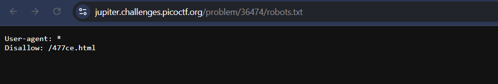

## Where are the Robots  (Pico CTF)
## Difficulty - Easy
### STEP-1 Initial Observation
After opening the challenge website, the page displayed only a simple welcome message with no obvious clues.
The challenge title, “Where are the Robots?”, immediately hinted at the possible presence of a robots.txt file — a common location for hidden paths or disallowed URLs.

### STEP-2 Checking robots.txt
In web servers, the robots.txt file is used to instruct web crawlers on which parts of the site should or shouldn’t be indexed.
To check it, I appended /robots.txt to the base URL in the browser: (http://example.com/robots.txt)
This file revealed a Disallow directive pointing to a specific path that normal users (or crawlers) aren’t supposed to visit.

### STEP-3 Digging Deeper
I copied the disallowed directory from the robots.txt file and added it to the site’s URL.
Visiting this hidden directory/page led me to a new page that contained suspicious or encoded text, which turned out to include the challenge flag.

### STEP-4 Retrieving the Flag
Upon viewing the page source, I found the flag clearly written within the content.
I copied it and submitted it to the PicoCTF platform — successfully solving the challenge.

### Takeaway
This challenge demonstrates the importance of exploring standard web files and understanding how web crawling restrictions can sometimes reveal hidden or sensitive information. Always check for robots.txt when performing reconnaissance in web-based CTF challenges.
